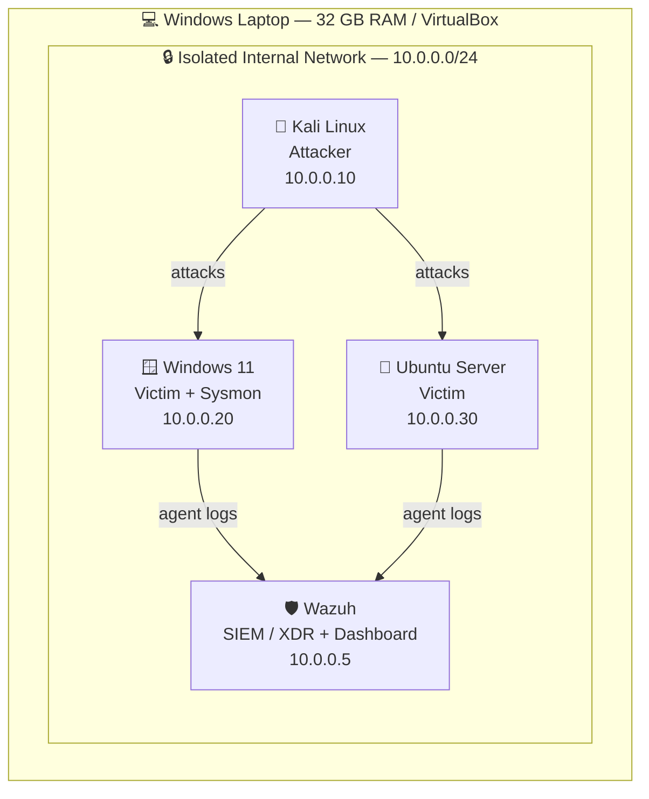
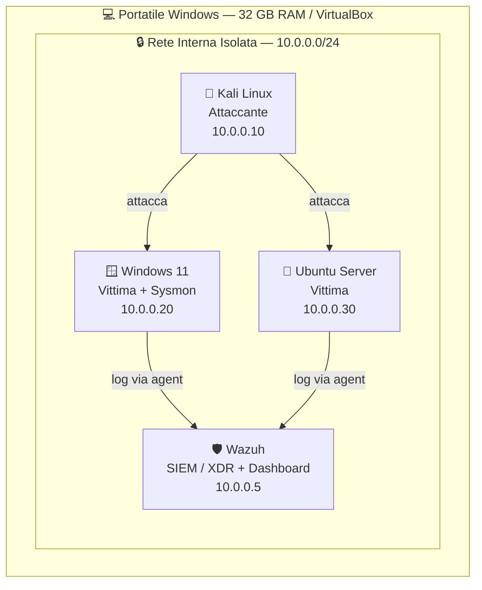

# 🛡️ Home SOC Lab
 


 
**[🇬🇧 English](#english) · [🇮🇹 Italiano](#italiano)**
 
---
 
<a id="english"></a>
 
> A self-built Security Operations Center for hands-on **blue team** practice: SIEM monitoring, attack simulation, detection engineering, and incident write-ups — all mapped to MITRE ATT&CK.
 
## 📌 Overview
 
This repository documents a home lab I built from scratch to develop practical **SOC Analyst** skills.
The goal is to reproduce, on a single workstation, the core daily workflow of a Security Operations Center:
 
1. **Collect** telemetry from endpoints (Windows + Linux).
2. **Detect** malicious activity using a SIEM/XDR.
3. **Triage** alerts: separate false positives from real incidents.
4. **Respond & document** each incident as a reproducible write-up.
Every attack I simulate is detonated against my own isolated machines, detected in the SIEM, and
mapped to the corresponding **MITRE ATT&CK** technique.
 
## 🗺️ Architecture
 
Everything runs in VirtualBox on a single Windows laptop (32 GB RAM), on a fully **isolated internal
network** with no access to the public internet — so attack traffic never leaves the lab.
 

 
## 🧩 Lab Components
 
| Role | Machine | RAM | Purpose |
|------|---------|-----|---------|
| SIEM / XDR | Wazuh (single-node) | ~6 GB | Log collection, correlation, alerting, dashboards |
| Victim | Windows 11 + **Sysmon** | 4 GB | Endpoint telemetry, process/PowerShell logging |
| Victim | Ubuntu Server | 2 GB | Linux logs, SSH brute-force target |
| Attacker | Kali Linux | 4 GB | Offensive tooling to generate detections |
 
## 📂 Repository Structure
 
```
home-soc-lab/
├── README.md
├── docs/
│   └── architecture.md          # detailed network & design notes
├── setup/
│   ├── 01-virtualbox-network.md # isolated network configuration
│   ├── 02-wazuh-install.md      # SIEM deployment
│   └── 03-agents-sysmon.md      # agents + Sysmon config
├── writeups/                    # one incident per file (the core of the project)
│   ├── 01-nmap-port-scan.md
│   ├── 02-ssh-brute-force.md
│   └── ...
├── detection-rules/
│   └── custom-wazuh-rules.md    # custom detection logic I wrote/tuned
└── tools/
    └── alert-enrichment/        # Python: enrich IPs/hashes via VirusTotal & AbuseIPDB
        └── enrich.py
```
 
## 🔍 Detection Write-ups
 
Each write-up follows the same structure: **attack performed → what appeared in the SIEM → the rule
that caught it → MITRE ATT&CK mapping → lessons learned.**
 
| # | Scenario | MITRE ATT&CK | Status |
|---|----------|--------------|--------|
| 01 | Network port scan (`nmap`) | T1046 / T1595 | Planned |
| 02 | SSH / RDP brute force | T1110 | Planned |
| 03 | Obfuscated PowerShell execution | T1059.001 | Planned |
| 04 | Malware test detonation (EICAR / Atomic Red Team) | T1204 | Planned |
| 05 | Custom detection rule (tuning) | — | Planned |
 
 
## 🛠️ Tools & Technologies
 
`Wazuh` · `Sysmon` · `VirtualBox` · `Kali Linux` · `nmap` · `Atomic Red Team` · `MITRE ATT&CK` ·
`Python` · `VirusTotal API` · `AbuseIPDB API`
 
## 🎯 Skills Demonstrated
 
- Deploying and operating a **SIEM/XDR** (Wazuh) end to end
- **Log analysis** across Windows (Sysmon) and Linux sources
- **Alert triage**: distinguishing false positives from real incidents
- **Detection engineering**: writing and tuning custom rules
- Mapping activity to the **MITRE ATT&CK** framework
- Light automation / **alert enrichment** with Python and threat-intel APIs

## 👤 About
 
Built and maintained by **Alessio Visconti** — aspiring SOC Analyst / Blue Team.
 
📫 *www.linkedin.com/in/alessio-visconti*
 
<br>
---
---
 
<br>
<a id="italiano"></a>

> Un Security Operations Center costruito da zero per fare pratica **blue team**: monitoraggio con SIEM, simulazione di attacchi, detection engineering e write-up degli incidenti — il tutto mappato su MITRE ATT&CK.
 
## 📌 Panoramica
 
Questo repository documenta un laboratorio casalingo costruito da zero per sviluppare competenze pratiche
da **SOC Analyst**. L'obiettivo è riprodurre, su una sola macchina, il flusso di lavoro quotidiano di un
Security Operations Center:
 
1. **Raccogliere** la telemetria dagli endpoint (Windows + Linux).
2. **Rilevare** le attività malevole tramite un SIEM/XDR.
3. **Fare triage** degli alert: distinguere i falsi positivi dagli incidenti reali.
4. **Rispondere e documentare** ogni incidente con un write-up riproducibile.
Ogni attacco che simulo viene lanciato contro le mie macchine isolate, rilevato nel SIEM e mappato
sulla tecnica **MITRE ATT&CK** corrispondente.
 
## 🗺️ Architettura
 
Tutto gira in VirtualBox su un solo portatile Windows (32 GB di RAM), su una **rete interna isolata**
senza accesso a internet — così il traffico d'attacco non esce mai dal laboratorio.
 

 
## 🧩 Componenti del Laboratorio
 
| Ruolo | Macchina | RAM | Scopo |
|-------|----------|-----|-------|
| SIEM / XDR | Wazuh (single-node) | ~6 GB | Raccolta log, correlazione, alerting, dashboard |
| Vittima | Windows 11 + **Sysmon** | 4 GB | Telemetria endpoint, logging processi/PowerShell |
| Vittima | Ubuntu Server | 2 GB | Log Linux, bersaglio per brute-force SSH |
| Attaccante | Kali Linux | 4 GB | Strumenti offensivi per generare le detection |
 
## 📂 Struttura del Repository
 
```
home-soc-lab/
├── README.md
├── docs/
│   └── architecture.md          # note dettagliate su rete e design
├── setup/
│   ├── 01-virtualbox-network.md # configurazione della rete isolata
│   ├── 02-wazuh-install.md      # deploy del SIEM
│   └── 03-agents-sysmon.md      # agent + configurazione Sysmon
├── writeups/                    # un incidente per file (il cuore del progetto)
│   ├── 01-nmap-port-scan.md
│   ├── 02-ssh-brute-force.md
│   └── ...
├── detection-rules/
│   └── custom-wazuh-rules.md    # regole di rilevamento scritte/affinate da me
└── tools/
    └── alert-enrichment/        # Python: arricchimento IP/hash via VirusTotal e AbuseIPDB
        └── enrich.py
```
 
## 🔍 Write-up delle Detection
 
Ogni write-up segue la stessa struttura: **attacco eseguito → cosa è apparso nel SIEM → la regola
che l'ha rilevato → mappatura MITRE ATT&CK → cosa ho imparato.**
 
| # | Scenario | MITRE ATT&CK | Stato |
|---|----------|--------------|-------|
| 01 | Port scan di rete (`nmap`) | T1046 / T1595 | Da fare |
| 02 | Brute force SSH / RDP | T1110 | Da fare |
| 03 | Esecuzione di PowerShell offuscata | T1059.001 | Da fare |
| 04 | Detonazione malware di test (EICAR / Atomic Red Team) | T1204 | Da fare |
| 05 | Regola di detection custom (tuning) | — | Da fare |
 
 
## 🛠️ Strumenti & Tecnologie
 
`Wazuh` · `Sysmon` · `VirtualBox` · `Kali Linux` · `nmap` · `Atomic Red Team` · `MITRE ATT&CK` ·
`Python` · `VirusTotal API` · `AbuseIPDB API`
 
## 🎯 Competenze Dimostrate
 
- Deploy e gestione end-to-end di un **SIEM/XDR** (Wazuh)
- **Analisi dei log** su sorgenti Windows (Sysmon) e Linux
- **Triage degli alert**: distinguere i falsi positivi dagli incidenti reali
- **Detection engineering**: scrittura e affinamento di regole custom
- Mappatura delle attività sul framework **MITRE ATT&CK**
- Automazione leggera / **arricchimento degli alert** con Python e API di threat intelligence

## 👤 Info
 
Realizzato e mantenuto da **Alessio Visconti** — aspirante SOC Analyst / Blue Team.
 
📫 *www.linkedin.com/in/alessio-visconti*
